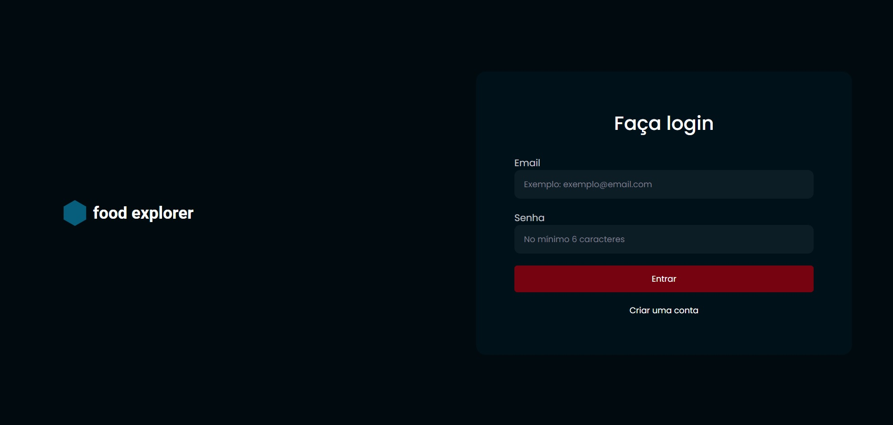
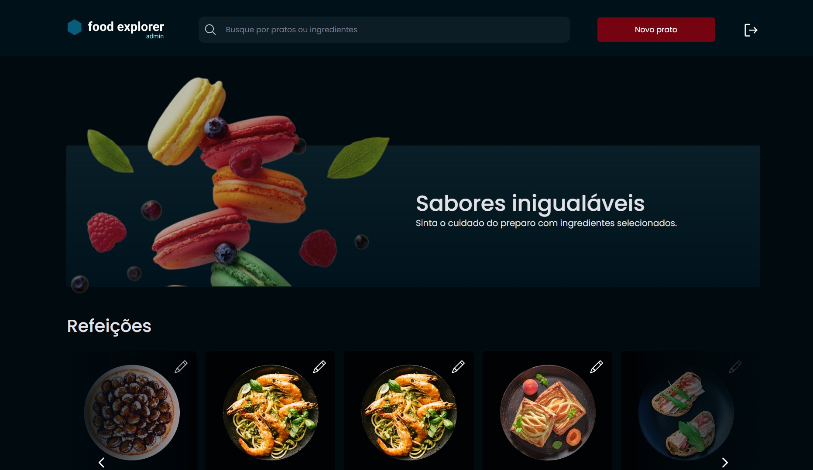

<h1 align='center'>
  Food Explorer
</h1>

<p align="center">
  <a href="#-repositórios">Repositórios</a>&nbsp;&nbsp;&nbsp;|&nbsp;&nbsp;&nbsp;
  <a href="#-projeto">Projeto</a>&nbsp;&nbsp;&nbsp;|&nbsp;&nbsp;&nbsp;
  <a href="#-páginas">Páginas</a>&nbsp;&nbsp;&nbsp;|&nbsp;&nbsp;&nbsp;
  <a href="#-funcionalidades">Funcionalidades</a>&nbsp;&nbsp;&nbsp;|&nbsp;&nbsp;&nbsp;
  <a href="#-tecnologias">Tecnologias</a>&nbsp;&nbsp;&nbsp;|&nbsp;&nbsp;&nbsp;
  <a href="#-utilização">Utilização</a>&nbsp;&nbsp;&nbsp;|&nbsp;&nbsp;&nbsp;
  <a href="#-personas">Personas</a>&nbsp;&nbsp;&nbsp;|&nbsp;&nbsp;&nbsp;
  <a href="https://main--strong-marzipan-55dfeb.netlify.app/">Deploy</a>
</p>

## 📌 Repositórios

### [Frontend](https://github.com/karencinca/food-explorer-front)
### [Backend](https://github.com/karencinca/food-explorer-front)

## 📁Projeto
O projeto Food Explorer consiste no desafio final do programa Explorer da Rocketseat. O projeto simula um cardápio digital de um restaurante e nele foi colocado em prática o que foi estudado ao longo do curso.




## 📄 Páginas
A aplicação contém as seguintes páginas:

- Login
- Cadastro
- Home
- Adicionar novo prato
- Detalhes do prato
- Editar prato

## 🔧 Funcionalidades
Este projeto possui as seguintes funcionalidades:

- Login
- Cadastro de usuário
- Cadastrar pratos
- Mostrar pratos cadastrados
- Filtrar pratos por nome e ingredientes
- Mostrar detalhes do prato
- Editar prato
- Excluir prato
- Logout

## 💻 Tecnologias
A aplicação foi construída utilizando as seguintes tecnologias:

- Axios
- React
- ReactDOM
- React Icons
- React Responsive
- React Router Dom
- Styled Components
- Vite

## ⚙ Utilização

1. Clone o projeto:

```
$ git clone https://github.com/karencinca/food-explorer-front
```

2. Acesse a pasta do projeto:

```
$ cd food-explorer-front
```

3. Instale as dependências:

```
$ npm install
```

4. Inicie o servidor:

```
$ npm run dev
```

⚠️ **Importante**: Este projeto utiliza uma hospedagem gratuita para o back-end, sendo assim, pode haver atrasos no tempo de resposta do servidor.

## 👩‍💻👨‍💻 Personas
Há duas formas de acessar a plataforma: como usuário comum ou como admin.
O <strong>admin</strong> pode cadastrar, editar e excluir pratos, enquanto que o <strong>usuário comum</strong> pode visualizar os pratos.

Login admin: admin@email.com |
senha: 123456

Login user: user@email.com | senha: 123456

Feito com 💜 por [Karen Cinca](https://www.linkedin.com/in/karencinca/)
